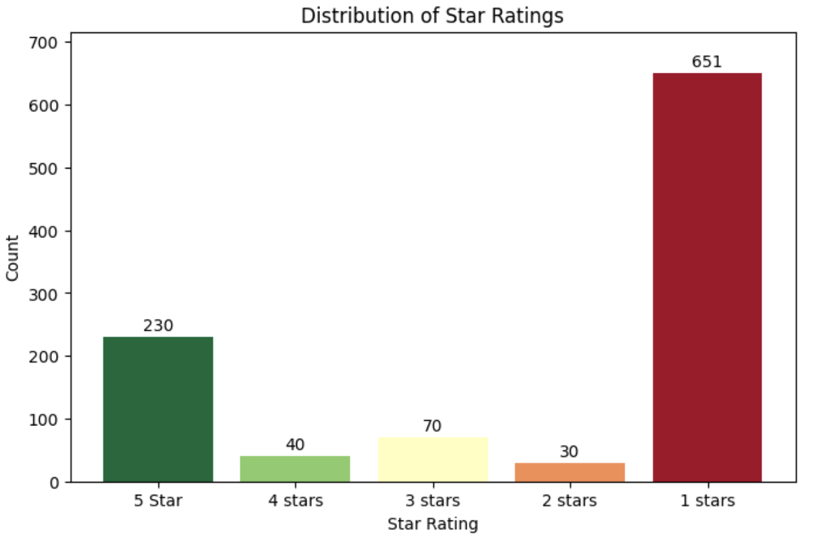

# Eric's Portfolio
Different projects I have done & keep tracking of my progress.

# [Tamjai Samgor Loyalty Program Evaluation]()

This is a group project to evaluate the current problems of TamJai's loyalty program and propose possible solutions to resolve those problems and also come up with innovative e-CRM stategies to further improve the loyalty program.

* Data was collected by web scrapping the ratings & comments from Google Play.
* Translate the comments from Chinese to English to ensure the data consistency and rephrase some sentences to enhance the accuracy of problem classification.
* Define different problem categories and leverage the LLM to do sentiment analysis and classification.
* Check the accuracy of the classification result and relabel the problem categories manually. 

## Tamjai's App Ratings

## Existing Problems of the Loyalty Program

# [Flight Infomation Database Creation & Management]()
# [HK Flag Day Volunteer Allocation System]()
# [Yahoo Finance Web Scrapping]()
# [Dashboards with IBM Cognos]()
